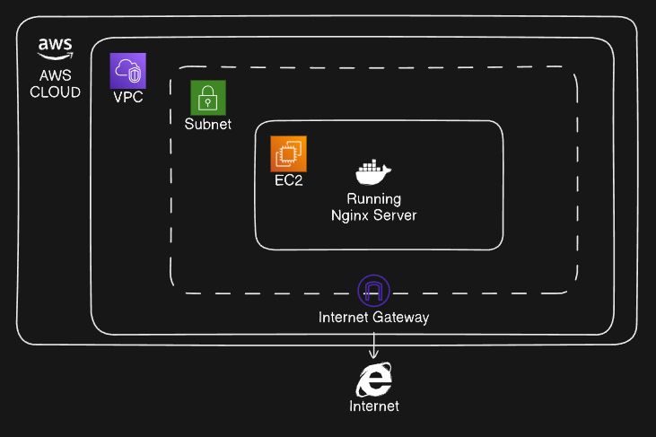

# Terraform EC2 Project

This project contains Terraform code to create an EC2 instance within a custom VPC, subnet, and security groups.

## Architecture



## Prerequisites

- Terraform
- AWS CLI configured with appropriate permissions

## Features

Following resources are created by the Terraform configuration:

- VPC
- Subnets
- Internet Gateway
- Route Tables
- Security Groups
- Key Pair
- EC2 Instance

## Workflow

1. Create a VPC with a CIDR block.
2. Create a subnet within the VPC.
3. Create an Internet Gateway and attach it to the VPC.
4. Create a Route Table and associate it with the subnet.
5. Create a Security Group for the EC2 instance.
6. Create a Key Pair for SSH access.
7. Create an EC2 instance within the subnet.

## Usage

1. **Clone the repository:**

   ```sh
   git clone https://github.com/Ayroid/terraform-ec2-project.git
   cd terraform-ec2-project
   ```

2. **Initialize Terraform:**

   ```sh
   terraform init
   ```

   Review and modify variables.tf to set your desired values.

3. **Apply the Terraform configuration:**

   ```sh
   terraform apply -var-file=variables.tfvars
   ```

   Confirm the apply action and wait for the resources to be created.

## Variables

- aws_region - AWS region to create the resources
- aws_access_key - AWS access key
- aws_secret_key - AWS secret key
- vpc_name - Name of the VPC
- vpc_cidr_block - CIDR block for the VPC
- subnet_name - Name of the subnet
- subnet_cidr_block - CIDR block for the subnet
- availability_zone - Availability zone for the subnet
- instance_type - EC2 instance type
- env-prefix - Prefix for the resource names
- key_name - Name of the key pair
- key_path - Path to the private key file
- my-ip - IP address to allow SSH access

## Outputs

- aws_ami_id - ID of the AMI used for the EC2 instance
- public_ip - Public IP address of the EC2 instance

## Cleanup

To destroy the created resources, run:

```sh
terraform destroy -var-file=variables.tfvars
```

## Conclusion

This project demonstrates how to create an EC2 instance using Terraform. You can extend the configuration to include additional resources like RDS, S3, etc. by adding more Terraform modules.
